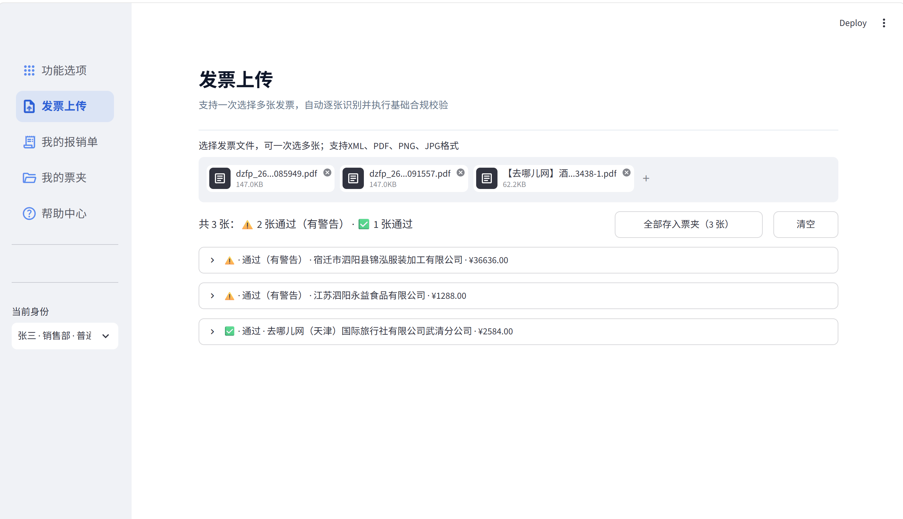
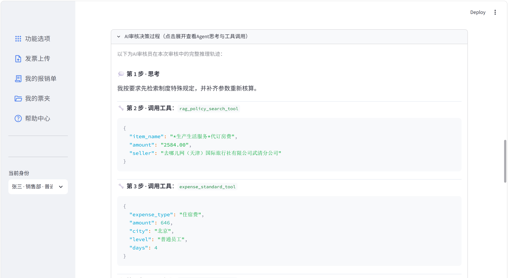
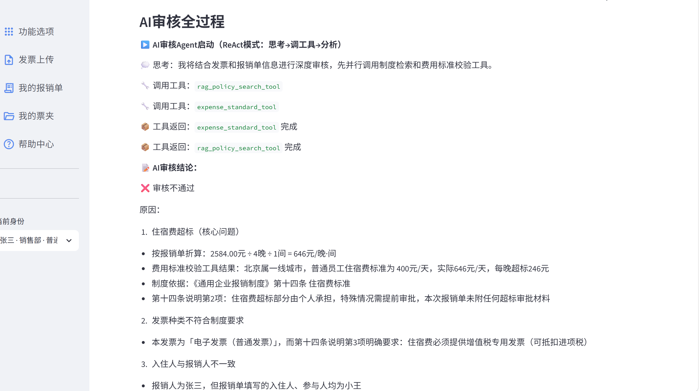

# 数电票智能预审 Agent —— 应用方案

> 2026 年 iCAN 大学生创新创业大赛 · AI 应用创新挑战赛 · 软件赛道
> 面向高校与中小企业的数电票智能预审 Agent

---

## 摘要

本作品是一套面向高校与中小企业的**数电票智能预审 Agent**。它针对的是一个很具体的问题：企业报销审核中，金额超标、重复报销、事由与票面不符等判断长期依赖人工逐张核对，而这些判断恰好分成两类——**有唯一答案的**（金额、期限、号码格式、费用标准）与**没有唯一答案的**（费用性质、事由相关性、制度例外的适用）。

本作品的立场是：**AI 只做应当由它做的事。** 有唯一答案的判断整体移出模型，交由纯函数与规则裁决；没有唯一答案的判断才交给 Agent 理解；模型说出的每个数字、每条依据，再由校验层逐条对账。之所以要划这条边界，是因为企业有既定的流程与制度，而生成式模型的输出是概率性的——**企业不敢把需要担责的判断，交给一个说不出依据、也无法复现的结论。**

这一设计的效果可以度量：在 24 条具有唯一金标准的用例上，纯规则引擎判对 41.7%，完整链路 87.5%；在语义判断要求最高的 16 条上，二者分别为 18.8% 与 87.5%。AI 的增量出现在哪一段，是可以指出来的。

## 一、项目背景

### 1.1 政策与合规背景：数电票的三份输入，XML 优先

全面数字化电子发票（下称数电票）在全国推广后，同一张发票在企业手中往往存在三种形态：**XML 数据文件、PDF / OFD 版式文件，以及纸质打印件或屏幕截图**。与此同时，国家关于电子会计凭证报销入账归档的相关规定，已明确电子凭证可依法作为报销入账的依据，这为「以电子原件作为审核起点」提供了合规基础。

然而对系统而言，这三种输入的价值并不等同：

| 输入形态 | 性质 | 对系统的含义 |
| --- | --- | --- |
| **XML** | 数据电文原件，字段完整、机器可读 | 无识别误差，是**精度最高的数据源** |
| **PDF / OFD** | 供阅读与归档的版式文件 | 结构不作保证，需借助文字块坐标还原明细 |
| **图片 / 扫描件** | 纸质凭证的电子化产物 | 仅能依赖 OCR，误差最大 |

录入环节的误差会在后续逐层放大，它划定了所有下游判断——包括模型语义理解——的精度上限。因此本作品在这一环节不调用大语言模型，而是按可得性依次降级：具备 XML 时直接读取原件，仅有版式文件时采用坐标法还原，仅剩图片时才启用专用 OCR 模型兜底。

### 1.2 业务背景：单据量与编制的不匹配

数电票推广之后，报销从「纸质传递」转为「线上提交」，提交门槛下降，单据量持续上升；而高校财务处与中小企业出纳岗位的编制并未同步扩充。一张差旅报销单需逐项核对抬头、税号、金额勾稽、住宿标准、是否重复报销，单张耗时 3–8 分钟。

这部分工作有一个共同特点：**耗时并不来自判断难度，而来自逐项核对的次数**。审核的重心因此有必要前移——把可在提交环节完成的核对，放到提交环节完成。

### 1.3 本项目赛题方向

面向高校与中小企业的**数电票智能预审 Agent**：以 XML 优先的三路识别为起点，由规则拦截确定性硬伤，由 RAG 引用制度原文，由 Agent 给出可追溯、可追问的审核结论。本作品定位为**预审助手**，不宣称替代财务终审。

对标大赛参考赛题方向中的**企业服务**（财务与费控数字化），并覆盖其中**金融**方向的费用合规与舞弊识别场景。选择这一方向的理由在于：财务报销是所有组织均需承担、单据量最大、且长期依靠人力支撑的高频业务；其 AI 介入点边界清晰，落地不依赖专用硬件，企业既有的制度文本即可直接构建为知识库。

### 1.4 核心创新与差异化优势

| 创新点 | 一句话说明 | 与常见做法的分别 |
| --- | --- | --- |
| **确定性边界被强制执行** | 有唯一答案的判断（金额勾稽、期限、号码格式、费用标准）整体移出模型，模型只在语义侧出场；这条边界由校验层拦截越界结论来执行，而非写进提示词当约定 | 常见做法把整张单据交给模型，既算金额又下结论；模型算错一个数，整张结论即不可用 |
| **结论以字段承载，而非自然语言** | 审核结论由 Pydantic 枚举字段承载，程序可直接读取 | 常见做法由模型输出一段文字，程序再依据关键词判断结论；实测会将「超标，不通过」误判为「通过」 |
| **无制度依据不得作出驳回** | 判定「不通过」必须给出制度条款，无法给出则转人工 | 常见做法将驳回理由交由模型自由裁量，员工无从追溯，也无可申诉 |
| **所述内容逐条对账** | 13 项防幻觉校验与工具返回值逐条核对，矛盾时可改写结论 | 常见做法仅在提示词中要求「不要编造」，可信度取决于模型的自觉 |
| **反思受护栏约束** | 出现矛盾时允许 Agent 追加检索并修正结论，但仅限一轮，且无新证据不得放宽结论 | 常见做法或不做自纠，或让模型反复自我修订；前者一次判错无法挽回，后者成本与结论稳定性均不可控 |
| **识别路径按可得性降级** | XML 直读法定原件，版式文件以坐标法还原明细，图片走 OCR 兜底，三路并存 | 常见做法一律拍照或经 PDF 后再 OCR，从起点就引入识别误差 |
| **风控前置并强制写入模型上下文** | 6 项行为风控在模型判断之前完成，并要求结论必须点名风险项 | 常见做法在事后审计阶段才发现连号、拆单、临界金额等异常 |

这七条并非互不相关的功能。**末两条决定 AI 拿到的是什么输入**——识别的精度与风险的可见性；**前五条则构成一条完整的约束链**：先划清模型该做什么，再规定它必须怎么输出，然后约束它何时不得下结论，接着核验它说出的每一句话，最后在出现矛盾时给它一次受控的纠错机会。

它们共同回答的是 AI 进入企业财务时最实际的问题：**企业财务的本质是规范化与流程化——判断要有依据，结论要留痕，责任要可追溯；而大模型天生是概率性的、开放的。二者如何共处？** 常见做法走向两个极端：或把 AI 置于流程之外，做一个与制度无关的问答助手；或把整张单据交给模型，让它越过规范直接下结论。本作品取第三条路——**让 AI 进入流程内部，但不接管流程**：有唯一答案的判断交给规则，模型何时不得下结论由制度约束，模型说出的每个数字由计算核验，AI 只承担流程中唯一需要理解语义的那一段。AI 创新由此不再体现为「用了什么模型」，而体现为**一次可审计的人机分工**。

## 二、痛点问题

### 2.1 业务侧的四个现象

| 痛点 | 现在怎么做 | 后果 |
| --- | --- | --- |
| 硬性错误依赖人工识别 | 抬头、税号、金额勾稽逐项核对 | 漏检重复报销与过期票；单张耗时 3–8 分钟 |
| 制度检索依赖翻查文档 | 由财务口头解释 | 同类案件处理口径不一，员工反复修改单据 |
| 异常行为难以发现 | 连号、拆单、临界金额依赖经验判断 | 风险事后方才暴露，追责成本高 |
| 结论不可追问 | 驳回仅写「不符合规定」 | 咨询占据财务人员大量工作时间 |

这四个现象长期存在，原因不在执行不力——逐项重复核对本就不适合长期由人承担，注意力会随单据累积而衰减。更根本的原因，藏在这些现象共同的内部结构里。

### 2.2 痛点的共同结构：同一张单据上并存两类判断

把上述现象拆开看，会发现它们并非同一种困难。以一张住宿费发票为例，它同时带来两类问题。

**第一类有唯一答案。** 金额是否勾稽、发票是否重复、抬头税号是否正确、开票日期是否在有效期内——制度与算术已给出确定答案，对错可以验证。

**第二类没有唯一答案。** 同一张发票上会出现这样一些问题：

- 出差城市是苏州，属于几线城市？适用哪一档标准？
- 员工填报 4 晚，但发票开票日期跨度只有 2 晚，应按几天计算？
- 金额超标，但制度中写明「特殊情况需提前审批」，这笔是否具备审批？
- 发票开具的是「代订房费」，员工填写的费用类型是「办公费」，二者是否相符？

这些问题需要理解制度条文的措辞、结合上下文推理、交叉比对多个字段，才能回答。

两类困难的失误形式并不相同：第一类的失误是**漏检**——本可以算对，却因为要核对的项数太多而看漏；第二类的失误是**误判**——结论取决于理解，而理解可能因人而异。成因不同，能用来应对它们的手段也不同。

### 2.3 更深的一层：企业为何不敢把这件事交给 AI

如果说 2.1、2.2 讲的是「人工做这件事的代价」，那么还有一层代价不易被看见：**这件事目前也难以交给 AI 承担。**

障碍不在识别精度。近年 OCR 与票据结构化已相当成熟，把发票转成结构化数据这一步已不再是瓶颈。真正的障碍在于财务结论的性质：

- 财务结论是**责任性结论**。它要能回答「依据是什么」，要能在事后被复核、被追溯，员工需要有一个可以申诉的对象。
- 而生成式 AI 的输出是**概率性的**。同一个问题问两次，可能得到两种措辞；结论取决于模型的发挥，而不是一条可被指认的规定。

两者放在一起，矛盾就出现了：**企业不是不愿意用 AI，而是不敢把一个需要担责的判断，交给一个说不出依据、也无法复现的结论。**

现有做法往往走向两个极端，而两端都不解决这个问题：

- **把 AI 放在流程之外**——做一个与制度无关的问答助手，回答流畅，但不参与任何实际判断，也就无所谓可信与否。
- **把整张单据交给 AI**——让它既算金额又下结论。一旦其中某个数字算错，整张单据的结论都无法使用，而错在哪里又无从指认。

两条路都没有回答那个真正的问题：**当 AI 参与财务判断时，如何让它的结论既能用，又能被追责。**

本章这两层问题构成了后文的全部出发点：3.1 的四项硬需求是对它们的直接回应，3.2 划定的确定性边界则是「让 AI 可被追责」在技术上的具体落点。

---

## 三、需求分析

### 3.1 从痛点反推的四项硬需求

| # | 需求 | 为什么必须满足 |
| --- | --- | --- |
| 1 | **识别要准** | 能够取得法定原件时即无需 OCR；数据一旦有误，后续判断全部失效 |
| 2 | **可计算的不交由模型** | 金额勾稽、是否超标均有唯一答案；模型算错一个数值，整张单据的结论即失去意义 |
| 3 | **需要语义理解的才交由模型** | 这是规则无法穷举的部分，也是 AI 真正不可或缺之处 |
| 4 | **结论必须可被追问** | 每条结论都应能回答「依据何在」，并指明来自哪个工具、哪一条制度 |

第 4 条是本系统与「黑盒 AI」的分界线，也直接决定了后文技术方案中必须设置**防幻觉校验层**。

### 3.2 关键技术判断：划定确定性边界

既然确定性问题与语义问题需分开处理，就必须明确划分一条边界，并由程序**强制执行**，而非依赖提示词的自觉：

| 归属 | 判断内容 | 由谁裁决 |
| --- | --- | --- |
| 确定性侧 | 金额勾稽、明细汇总、单价核对、日期期限、号码格式、重复检测、税率、抬头税号 | 纯代码规则（毫秒级、结果唯一） |
| 确定性侧 | 住宿 / 交通 / 伙食的金额标准核算 | 纯函数工具（唯一数值来源） |
| 确定性侧 | 重复 / 连号 / 拆分 / 临界 / 高频 / 行为画像 | 纯 SQL 风控 |
| 语义侧 | 票面项目名称指向哪一类费用（住宿费 / 餐饮费 / 交通费 / 办公费） | Agent：商品名与业务含义的对应无法穷举 |
| 语义侧 | 该费用情形应适用制度中的哪一条款，条款是否附有例外与前置条件 | Agent 调 RAG 检索，条款原文随结论一并输出 |
| 语义侧 | 报销事由、费用类型、票面内容三者是否自洽；发票与报销单是否相互矛盾 | Agent：需交叉比对多字段，并以票面为准保留矛盾点 |
| 语义侧 | 不通过时的依据表述与补救方向 | Agent：需把工具返回值转为员工可执行的说明 |

边界由**校验层**执行：一旦模型结论与工具返回值相矛盾，立即拦截或退回重新核查。

### 3.3 非功能需求

| 维度 | 要求 | 落实方式 |
| --- | --- | --- |
| 效率 | 基础校验为毫秒级，单张完整预审控制在 1 分钟内；不将 token 消耗在规则可解决的问题上 | 12 项基础校验为纯代码；校验不通过直接拦截，不进入模型 |
| 稳定 | 单张异常不影响整批处理 | 多张上传逐张处理；识别失败的发票同样生成卡片、置顶并附失败原因 |
| 可信 | 结论可复核 | 13 项防幻觉校验，以及完整的工具调用轨迹留痕 |
| 可演示 | 评审现场即可看清 AI 的作用 | Agent 推理过程实时渲染于页面（工具名 / 参数 / 返回值 / 制度原文） |

---

## 四、目标用户群体与功能需求

### 4.1 三类角色

| 角色 | 核心诉求 | 对应功能 |
| --- | --- | --- |
| **报销员工** | 上传发票、查看预审结果、填报单据、被驳回后明确修改方向 | 发票上传、我的票夹、发票详情、报销单填写 |
| **财务初审** | 查看规则结果、风控标识与 Agent 依据，决定放行或退回 | 我的报销单、报销单详情（含轨迹与校验报告） |
| **制度管理员** | 维护知识库（住宿标准、招待规定、违规案例） | 帮助中心左侧制度文档导航（修改 Markdown 即时生效） |

### 4.2 可验收的功能需求

#### 基础功能

1. **秒级基础合规结论**：上传数电票后即执行 12 项基础校验，逐项列出通过 / 不通过及原因（识别与校验合计在 1 分钟内完成）。
2. **多张同时上传**：一次可上传多张，每张独立成卡；识别失败与校验不通过的卡片自动置顶。
3. **提交即风控**：提交报销单时自动运行 6 项行为风控——重复、连号、拆分、临界、高频、行为画像。
4. **准入闸门**：基础校验不通过的发票不得进入填单环节。
5. **发票号码免填**：发票号码由系统从票夹带入，无需用户手动填写。

#### AI 深度审核

6. **事由语义审核**：员工填写事由后，由独立 LLM 判断「报销事由 ↔ 票面内容 ↔ 费用类型」是否自洽；不通过时弹窗拦截保存，结果按表单指纹缓存。
7. **ReAct Agent 自主调用工具**：Agent 在审核过程中自主调用费用标准工具与制度检索工具，每一步思考与工具调用实时推送至界面；审核结束后可回看完整轨迹。
8. **结构化裁决**：终审结论由 Pydantic Schema 承载，包含判定结论、费用类型、判定理由、证据链、引用条款、置信度、是否转人工，程序可直接读取，杜绝模糊表述。
9. **13 项防幻觉校验**：结论须通过 13 项程序化核对——结论取值合法、证据来源白名单、工具调用可溯源、结论与证据自洽、结论未遗漏工具判定、风控高危已被吸收、金额可溯源、条款引用可溯源、通过需有证据、条款门禁（不通过需依据 / 通过需计算）、人工确认已吸收、置信度水平；任一项失败即拦截或转人工。
10. **双向条款门禁**：判「不通过」必须有制度条款依据，判「通过」必须有工具确认结果，不允许无依据下结论。
11. **受约束的反思闭环**：校验发现可澄清的矛盾时，Agent 自动发起第二轮审核补充证据并重新裁决，仅限一轮；结论收紧可直接生效，放宽则必须同时新增工具调用与条款引用。
12. **费用标准口径可追溯**：费用标准工具返回必带口径来源（城市等级、员工职级、标准条款），任一项缺失即拒绝计算并转人工。

#### 员工交互

13. **多轮追问**：员工可针对本张发票连续追问（「为什么不通过」「超标了怎么办」）。
14. **引用溯源**：每条回答下方附「本次回答引用的制度原文」，可展开查看完整条款与相关度。
15. **可审计回看**：审核结束后可分段回看三份记录——风控检测结果、Agent 完整推理轨迹（思考 → 工具调用 → 工具返回 → 结构化裁决）、13 项防幻觉校验报告。

### 4.3 功能边界（本作品不作覆盖的范围）

- 不替代银行回单、预算占用与银企支付。
- 不承诺图片发票 100% 的识别率（演示以 XML 与版式 PDF 为准）。
- Agent 结论属于预审建议，最终入账仍由财务确认。

---

## 五、开发工具

| 类别 | 工具 / 库 | 版本 | 作用 |
| --- | --- | --- | --- |
| 开发语言 | Python | 3.11 | — |
| 界面框架 | Streamlit 多页应用 | 1.63.0 | `st.navigation` 路由 + 注入 CSS 统一全站视觉 |
| 智能体框架 | LangGraph `create_react_agent` + LangChain Core | 1.6.1 | ReAct 循环：思考 → 调用工具 → 观察 → 裁决 |
| 大模型 | 阿里云百炼 通义千问（OpenAI 兼容接口） | `qwen3.8-max` | 仅承担语义理解与解释 |
| 结构化输出 | Pydantic | 2.13.4 | 将审核结论固化为枚举字段 |
| 检索 | 自研 BM25 + `m3e-small` 向量模型 + jieba | — | 制度条款定位 |
| 文档解析 | pdfplumber | 0.11.10 | 按文字块坐标还原明细表 |
| OCR | 阿里云 OCR `RecognizeGeneralStructure` | — | JPG / PNG 兜底识别 |
| 数据库 | SQLite | — | 发票、明细、报销单、员工 |
| 评测 | 自研消融 / 注入脚本 | — | 量化 AI 与各校验层的实际贡献 |

---

## 六、技术方案

### 6.1 总体架构

```
发票文件（XML / PDF / 图片）
        │
        ▼  识别层：XML 直读法定原件 ｜ PDF 坐标法还原明细 ｜ 图片 OCR 兜底
   结构化发票数据
        │
        ▼  ① 12 项基础合规校验（纯代码 · 毫秒级 · 结果唯一）
        │     └─ 不通过 → 直接拦截，不进入模型，不产生调用开销
        ▼  票夹（原件 + 识别结果 + 校验结论一并入库）
        │
        ▼  员工填写报销单（统一主表 + 分类扩展 · 发票明细自动注入）
        │
        ▼  ② 6 项行为风控（纯 SQL + 代码 · 不使用 AI）
        ▼  ③ ReviewAgent（ReAct：自主决定调用哪个工具、综合、解释）
        ▼     - 制度 RAG（仅检索原文 · 不作判断）
        ▼     -费用标准工具（纯函数 · AI 唯一的数值来源）
        ▼  ④ 结构化抽取（第二次独立模型调用 · schema 约束枚举，结论以字段承载）
        ▼  ⑤ 13 项防幻觉校验（与工具返回值逐条对账，可改写结论）
        ▼  ⑥ 反思（仅一轮：可澄清的矛盾退回 Agent 再核查）
     最终裁决 ──▶ 报销单详情（结论 + 推理轨迹 + 校验报告）
        │
        └──▶ 帮助中心 Agent（ConsultAgent + 制度 RAG 问答）
                 携带本张发票与基础校验结果 · 支持多轮追问 · 不参与裁决
```
全链路中，AI 出现在七处，按角色分五类：

- **看懂**：图片发票走 OCR 结构性抽取（判别式模型），XML 与版式 PDF 则不借助模型；
- **找到**：制度检索由向量嵌入（判别式模型）与 BM25 双路召回，模型只负责「定位条文」；
- **判断**：事由语义审核与审核 Agent 各自独立调用大模型，前者判断事由与票面是否相符，后者决定调用哪个工具、如何解释结论；
- **固化**：结构化抽取器以第二次独立调用把结论写入 schema 字段，再由 13 项校验逐条对账；
- **应答**：帮助中心由咨询 Agent 与制度问答两处独立调用承担，只面向员工提问，不参与裁决。

其余环节——字段校验、金额核算、行为风控、结论解析、对账——全部由确定性代码承担。把 AI 的出场范围压到如此之窄，并非保守，而是财务结论必须可复现：**凡是能算的不问模型，凡是问模型的必须可核。**

### 6.2 三条设计红线

**红线一：金额不交由大模型计算。**
所有数值判定均在纯函数中完成，模型只负责判断费用类型、决定调用哪个工具，以及向人解释结论。校验层是这条边界的执行者——模型结论一旦与工具返回值相矛盾，立即拦截。

**红线二：结论不依赖文本推断。**
早期实现由模型输出自然语言，程序再依据「关键词出现顺序」推断结论。实测反例如下：

```
输入：我通过调用费用标准工具核对后确认，该笔住宿费超标，审核不通过。
旧逻辑输出：通过            ← 一张超标发票被放行
```

如今结论被定义为 Pydantic 枚举字段，模型在解码阶段只能向 `verdict` 填入「通过」或「不通过」。**结论由「需要推断的文本」变为「可以直接读取的字段」。**

**红线三：无依据不得下结论，正反两侧均设门禁。**
制度门禁共两条：判定「不通过」却无法给出制度条款时，予以硬拦截，改为「无依据 → 转人工」；判定「通过」时，同样必须由费用标准工具明确确认通过，工具未确认则不得判通过。这使「引用溯源」由界面上的展示项上升为硬性约束——**结论要么有条款，要么有计算，两者皆无即转人工。**


### 6.3 关键实现

**识别层**：数电票 XML 直接读取结构化字段；版式 PDF 由 pdfplumber 提取文字块坐标，定位表头行后以各列中心点划分列边界，再按 y 坐标聚行还原明细表；针对 PDF 中「数量单价」被粘连为长串的脏数据，采用穷举切分求取 `数量 × 单价 ≈ 金额` 的最小误差解。多张上传时按文件 按文件 SHA-256 指纹缓存，仅解析确实新增的文件。

**校验层**：12 项基础合规校验与 6 项行为风控，全部为纯代码实现。风控覆盖重复报销、连号发票、拆分报销、金额临界（审批阈值 95% 以上）、高频报销（部门人均 2 倍）与员工行为画像。

**制度层（自研检索 · 效果可测）**：知识库采用 Markdown，按标题层级分块（最大 300 字、块间重叠 2 句）；检索为自研实现——BM25 为手写实现并设专有名词加权（权重 2.0），向量侧以 m3e-small 生成语义向量，两路召回后按 BM25 0.6 / 向量 0.4 加权融合，输出条款原文与出处。之所以不引入向量数据库，是因为本场景的知识库规模有限（当前 4 份制度文档、72 个文本块），而公司制度中存在大量必须精确命中的术语——条款序号、「合住」「私车公用」这类专有表述——纯语义检索会把「住宿费标准」与「住宿超标怎么办」混为一谈。BM25 保术语精确，向量保语义泛化，二者的加权融合正是为这一对需求设计的。全链路设分块、BM25、向量三级缓存，重复检索不重算。

检索效果可复现：`tests/test_rag_recall.py` 以 20 条真实业务问句为查询集，逐条标注应命中的条款关键词，判定口径为「该关键词是否出现在检索返回的文本块中」，实测 **Recall@1 = 85.0%（17/20），Recall@3 = 100%（20/20）**。

**工具层（口径不由模型的自觉决定）**：费用标准是「职级 × 城市等级」查表所得，同一笔金额在不同职级下结论相反。因此工具层设三道约束：其一，职级、发票金额、出差城市、住宿晚数由流程在调用前注入工具上下文，模型漏传时自动以系统值兜底，避免退化为默认档的静默降级；其二，模型若传入与系统值不同的参数，工具在返回值中**标注该覆盖项**（系统值 / 模型值），供校验层与页面追踪；其三，城市为空、城市无法识别、职级无对应标准、费用类型无标准依据时，**一律不套用默认档**，直接返回「待人工确认」。每次核算必须一并给出 `source_clause`（依据哪条标准）与 `caliber`（城市几线 × 职级档位）；口径缺失即 `needs_human=True`，交由人工。

**Agent 层**：`ReviewAgent` 基于 LangGraph ReAct 循环，挂载费用标准工具与制度检索工具；`AgentTrace` 逐步记录思考过程、工具调用参数、工具返回原文与最终结论，同一份数据两用——页面据此渲染时间轴，校验层据此逐条对账。`ConsultAgent` 负责帮助中心问答，并携带本张发票的上下文。

**抽取层（第二次模型调用 · 职责分离）**：结构化裁决并非由审核 Agent 一并产出，而是交由独立的抽取器完成第二次调用。审核 Agent 的职责是「调查与解释」——它掌握完整对话、工具轨迹与矛盾点；抽取器只接收结论文本与工具返回值，在 `temperature=0`、关闭思考模式的条件下，把结论固化为 schema 字段。分离带来两点收益：抽取器输入干净，不受探索性表述干扰；关闭思考模式后，单次抽取耗时由 52.2 秒降至 13.7 秒。**让模型做它擅长的事，让程序做它能确定的事**，这一分工贯穿全链路。

**后处理层**：

- **结构化裁决**：结论、费用类型、理由清单、证据链、条款引用、置信度、是否转人工，全部固化为字段。证据的 `source` 只能填入 5 个白名单来源之一，`fact` 中的数字必须与来源返回值完全一致。
- **13 项防幻觉校验**：结论取值合法 / 证据来源合法 / 工具调用可溯源 / 结论与证据自洽 / 结论未遗漏工具判定 / 风控高危已被吸收 / 金额可溯源 / 条款引用可溯源 / 通过需有证据 / 条款门禁（不通过需依据）/ 条款门禁（通过需计算）/ 人工确认已吸收 / 置信度水平。
- **反思机制**：分流（筛出可澄清的矛盾）→ 指令（要求追加检索、补齐参数）→ 收敛（第二轮必须复检，且**无新证据不得放宽结论**）。与校验层共享同一套判据，避免两处口径漂移；仅开放一次机会，以控制成本。
- **反思层的两条补充判据**：其一，**参数口径可确认**——住宿费核算必须带出差城市，缺失即报错，不允许在不知城市的前提下比对标准；其二，**工具判定与制度一致性**——当工具判定超标、而检索到的条款含「提前审批」「特殊情况」「据实报销」等例外表述时，不直接采信工具结论，转而告警并交人工。
### 6.4 效果验证

本作品为 AI 与各校验层建立了可复现的评测体系（`eval/`，不修改主流程的任何代码）。

**用例集**：24 条，全部具有制度唯一确定的金标准。其中 8 条为制度金额类（住宿城市 × 职级 × 金额），12 条为语义一致性类（票面与报销单是否对应），4 条为语义陷阱类（金额全部合规，唯一违规点在于语义）。**其中 12 条为对抗样本**——金额均落在标准之内，仅凭数字无法判定。

**AI 相对纯规则引擎的增量**

| 类别 | 条数 | 纯规则判对 | 转人工 | Agent 判对 | 增量 |
| --- | --- | --- | --- | --- | --- |
| 制度金额类 | 8 | 7 | 0 | 7 | +0.0pp |
| 语义一致性类 | 12 | 3 | 3 | 10 | **+58.3pp** |
| 语义陷阱类 | 4 | 0 | 2 | 4 | **+100.0pp** |
| **合计** | **24** | **10（41.7%）** | **5** | **21（87.5%）** | **+45.8pp** |

**对抗样本子集（12 条）：纯规则 0/12（0%），Agent 12/12（100%）。**

> 这张表说明了架构的合理性：**在金额类判断上，规则层与 AI 表现相当（7/8 持平）；在语义类判断上，规则层仅为 18.8%，AI 达到 87.5%。** 规则层对没有标准可依的费用类型返回「转人工」，而非强行判定，从而避免误伤合规单据。

**结构化裁决的价值（陷阱句注入，120 条文本）**：同一批结论换成不同措辞后，旧字符串位置解析仅判对 40/120（33.3%），其中错误放行 70 条——真值为「不通过」却被判为「通过」，放行率 100%；结构化裁决不读自然语言，在同一批用例上判对 21/24（87.5%）。

**否定嵌套句专项（96 条文本）**：旧解析器判对 **0/96**。真值为「不通过」的句子写作「不予通过 / 无法通过 / 不能予以通过」时，句中并不存在「不通过」三字连续出现，字符串匹配直接判为通过；真值为「通过」的句子写作「不存在……不通过的情形」时，双重否定又被按位置判为不通过。结构化裁决读取枚举字段，对措辞差异完全不受影响。

**防幻觉校验的价值（注入 101 处已知幻觉）**：任意报警 101/101（100%），硬拦截 42/101（41.6%），干净样本误伤 **0/9（0%）**。硬拦截仅对可交叉核对的幻觉类型生效，语义类幻觉只告警不拦截——这是有意的保守设计，宁可提示也不误改。

**成本**：单用例平均 59.3 秒；消融实验的额外 token 消耗为 **0**（五组共用同一份模型输出，差异只来自后处理层）。

> 消融口径：五组依次为 C 纯规则、D 自由文本、B 结构化裁决、A 结构化 + 防幻觉校验、E A + 反思（交付态）；五组共用同一份模型输出，差别只在后处理层，因此额外 token 消耗为 0。

### 6.5 稳定性与效率

**工程侧**

- **分层拦截**：基础校验不通过即不进入模型，既控制成本，也避免模型被脏数据误导。
- **失败可见**：识别失败或校验未通过的发票同样生成卡片、置顶并附失败原因，不作静默丢弃。
- **增量识别**：按内容指纹缓存，重复上传不重复解析。
- **可复现**：评测与主流程完全解耦，可随时重跑并复现文中每一个数字。

**AI 侧**

- **结论不得因「重新生成」而改变**：反思仅开放一轮。结论收紧（通过 → 不通过）可直接生效；若要放宽，必须同时新增一次工具调用与一条新条款引用，否则维持第一轮结论——防止模型重跑一次就悄悄改变判定。
- **矛盾时以计算为准**：校验层发现结论与工具返回值相矛盾，以工具返回值为准改写结论，而非放行；无依据时转人工，而非默认通过。
- **参数不由模型自觉**：职级、金额、城市、住宿晚数由流程在调用前注入工具上下文；模型若覆盖系统值，工具在返回值中标注覆盖项，供校验层追踪。
- **失败不静默**：工具执行异常在推理轨迹中标记为失败步骤并在页面标红，不下沉为一条看似正常的返回。
- **抽取任务关闭思考模式**：结构化抽取以 `temperature=0`、关闭思考模式执行，同一输入输出稳定，单次耗时由 52.2 秒降至 13.7 秒。
- **实例与结果复用**：Agent 与检索服务在会话内复用，避免每次重跑重新初始化模型；制度检索设分块、BM25、向量三级缓存；事由语义审核按表单指纹缓存，内容未改动即复用上次结论。

**效率口径（如实标注测量边界）**

| 环节 | 耗时 | 来源 |
| --- | --- | --- |
| 单张基础合规校验（12 项） | 毫秒级 | 纯函数，无需网络 |
| 单张 Agent 终审（自 6 项风控起算，含模型调用与制度检索；不含发票识别与基础校验） | 平均 59.3 秒 | 本作品 24 条用例实测 |
| 人工初审单张单据 | 约 3–8 分钟 | 行业经验估计，**非本作品实测**，仅作量级参考 |

> 需要说明的是：预审并不能替代人工终审。它的价值在于将「具有唯一答案的判断」整体从人工环节移除，使财务人员只需处理真正需要判断的部分。

### 6.6 规则层自查：五类常见缺陷的针对性处理

规则写得多不等于写得对。本作品按以下五类缺陷逐项自查并落实处理：

| 缺陷形态 | 本作品的处理 |
| --- | --- |
| **静默降级** | 城市、职级、标准依据缺失时，不套用默认档继续计算，直接返回「待人工确认」 |
| **魔法数字** | 每个标准值都挂靠到具体条款（`source_clause`），与数值一并返回，可回答「这个数从哪来」 |
| **默认值过于宽松** | 校验层采用「无依据即转人工」，而非「无结论即通过」：出现任何 error 或 warning，`needs_human` 即为真 |
| **结论没有可读理由** | 每条结论必须携带理由清单与证据链，且其中金额须与工具返回值完全一致 |
| **边界输入未覆盖** | 城市为空、城市无法识别、职级越界、费用类型无标准依据，均有明确分支，不回退到默认档 |

---

## 七、作品功能说明

**AI 的位置：在企业流程里，让 AI 只做它该做的事。**

企业项目与演示作品的根本差别，在于前者有既定的流程与制度。一件事按什么标准办、办到什么程度算合规、不合规时走什么程序——制度已经写清楚了，不由模型裁量。这决定了对 AI 的要求不是「更聪明」，而是**可约束**：

- 模型可以发散，但结论必须收敛到制度允许的取值；
- 模型可以有自己的推理路径，但关键数字必须来自可指认的计算；
- 模型可以理解与表达，但不得越过流程直接下结论。

**三层边界**

- **确定的部分由纯函数裁决。** 金额勾稽、明细汇总、开票期限、号码格式、费用标准核算——这类判断有唯一答案，交给模型只会引入方差。
- **语义的部分由模型理解。** 票面项目名称指向哪一类费用、报销事由与票面内容是否相符、某笔费用是否落入制度条款的例外情形——这类判断无法穷举为规则，是 AI 真正不可替代之处。
- **模型输出的一切由校验层逐条对账。** 它说出的每个金额必须能溯源到某次工具返回；引用的每条条款必须真实存在于检索结果；结论方向不得与工具判定相悖。矛盾时以计算为准改写结论，无法核实时转人工。

三层是一条约束链：**先划清模型该做什么，再规定它必须怎么输出，最后核验它说出的每一句话。** 边界不由提示词维持——模型一旦越界，由程序拦截。

**为什么值得这样做**

财务结论是责任性结论：它要有依据、要留痕、要能被追问与申诉。而生成式模型的输出是概率性的——同一个问题问两次可能得到两种措辞。**企业不是不愿意用 AI，而是不敢把一个需要担责的判断，交给一个说不出依据、也无法复现的结论。** 本作品要回答的正是这个问题：**AI 只做应当由它做的事，不为用 AI 而用 AI，并且做得可被检验。**

边界划清之后，AI 的作用便不再是笼统的「提升了效率」，而可以被逐段度量：同一批模型输出，分别只保留规则层、只保留自然语言结论、保留结构化裁决、再叠加防幻觉校验与反思，比较各组准确率——规则层在语义类判断上仅 18.8%，完整链路达到 87.5%。**AI 的增量出现在哪一段，是可以指出来的。**

### 7.1 发票识别

- **功能**：支持一次选择多张，XML 数电票直接读取法定原件；版式 PDF 以坐标法还原明细表；图片走 OCR 兜底。
- **没有 AI**：识别本身属确定性问题，本就不应使用 AI——这是刻意作出的设计选择。
- **AI 增量**：针对 PDF 中被粘连为 `12437.735849056604` 这类脏数据，程序以穷举切分求取「数量 × 单价 ≈ 金额」的最小误差解，使原本无法读取的表格得以还原。

### 7.2 基础合规校验（12 项）

- **功能**：覆盖抬头、税号、金额勾稽、明细汇总、单价、日期期限、号码格式、重复报销、税率、大小写一致等，逐项给出通过 / 不通过及原因。
- **亮点 · 准入闸门**：校验不通过即拦截，不进入模型。这既控制调用成本，也避免模型被脏数据误导——规则层不只省钱，还是模型的第一道输入防线。
- **AI 增量**：无，且是刻意为之。具有唯一答案的事项交由代码处理，才能同时保证「快」与「确定」。



*图 1　上传后自动分为四档，识别失败与校验不通过的卡片自动置顶*

### 7.3 行为风控（6 项）

- **功能**：重复报销、连号发票、拆分报销、金额临界、高频报销、员工行为画像。
- **亮点 · 风控前置**：6 项检测在 Agent 之前完成，结果强制写入模型上下文，并要求结论必须点名命中风险项——常见的做法是把风控放在事后审计，本作品前移到决策之前。
- **AI 增量**：风控本身不使用 AI，但它是 AI 的输入材料。重复、连号、拆分是行业公认的舞弊模式，由规则算出、由模型解释，这一分工使作品解决的是真实问题。

### 7.4 事由语义审核（LLM 语义判断）

- **功能**：员工填写报销事由后，由一个独立的 LLM 环节判断「报销事由 ↔ 发票内容（销售方、项目名称）↔ 所选费用类型」三者是否逻辑一致，输出通过 / 警告 / 不通过及理由。
- **亮点 · 拦截而非提醒**：事由不通过时弹出对话框拦截保存，员工可查看详细分析后修正，或显式选择「确认保存草稿」；结果按表单指纹缓存，同一份内容不重复调用模型。
- **AI 增量**：这是纯粹的语义判断，规则无法穷举——「住宿费发票却填写为办公用品采购」这类不一致，只有模型能够发现，由此把「事由是否成立」从人工环节前移到填单环节。它与 Agent 终审分工明确：前者做单点判断，后者做综合裁决。

### 7.5 费用标准工具（AI 唯一的数值来源）

- **功能**：住宿（城市三级 × 职级三档，未列城市按其他城市处理）、市内交通 80 元/天、伙食补助 100 / 120 元/天，并返回命中的条款出处。
- **亮点 · 口径不可缺省**：每次核算必须同时给出城市等级、职级档位与依据条款（`caliber` / `source_clause`）；城市为空、城市无法识别、职级无标准、费用类型无标准依据时，不套用默认档，直接返回「待人工确认」——避免参数缺失时给出一个看似合理、实则口径错误的结论。
- **AI 增量**：模型自主决定是否调用该工具、参数如何填写、结果如何解读；但数值本身只来自这一个纯函数。工具负责「算得对」，模型负责「用得上」。

### 7.6 制度 RAG 检索

- **功能**：双路召回后加权融合，返回条款原文与出处。
- **亮点 · 自研检索**：BM25 为手写实现并设专有名词加权，与 m3e-small 向量召回加权融合，非调用现成检索库。实测 Recall@1 = 85.0%、Recall@3 = 100%（20 条真实业务问句）。规范术语（条款序号、「合住」「私车公用」）依赖关键词精确命中，纯语义检索会混淆近义条款，双路融合正是为此设计。
- **AI 增量**：使「依据」可被引用、可展开，而非由模型凭记忆复述制度条文。检索结果与条款原文一并留痕，构成后文引用溯源与条款门禁的数据基础。

### 7.7 ReviewAgent 终审（AI 核心）

- **功能**：ReAct 循环，自主决定调用费用标准工具或制度检索，综合风控结果与制度给出结构化裁决。
- **亮点 · 过程可审**：步骤序号、工具名、参数、返回值、制度原文全程留痕，页面可展开回看，审核结束后轨迹与校验报告一并入库。
- **AI 增量**：这是规则唯一无法覆盖的部分。若没有模型，系统只能输出「超标 80 元」这类数字，无法处理「事由与发票内容不匹配」「这笔餐费是否属于业务招待」等语义判断。在 12 条「金额完全落在标准之内、只能依靠语义判断」的对抗样本上，纯规则引擎判对 0 条，Agent 判对 12 条。



*图 2　Agent 推理轨迹：步骤序号、工具名、调用参数与返回值全程留痕，审核结束后可展开回看*

### 7.8 结构化裁决

- **功能**：将结论、费用类型、理由、证据链、条款引用、置信度、是否转人工固化为字段。
- **亮点 · 来源白名单**：每条证据的来源只能填入白名单之一，其中的数字必须与来源返回值完全一致——把「不许编造」从提示词里的要求，变成了字段级的约束。
- **AI 增量**：消除解析歧义，并使下游程序得以进行逐条对账。若没有结构化，防幻觉校验无从入手。



*图 3　结构化裁决：结论与逐条理由一并给出，每条理由均落到费用标准或制度条款*

### 7.9 防幻觉校验（13 项交叉核对）

- **功能**：结论与工具返回值是否矛盾、引用的工具是否确实调用过、金额能否溯源、条款引用是否命中检索原文、风控高危项是否被吸收等 13 项。
- **亮点 · 双向条款门禁**：判「不通过」必须有制度条款依据，判「通过」必须有工具确认结果——两侧都不允许无依据下结论。实测在注入 101 处已知幻觉时，任意报警 101/101，硬拦截 42/101，干净样本误伤 0/9。
- **AI 增量**：这是「敢于让模型下结论」的前提条件。若缺少这一层，系统的可信度将完全取决于模型的自觉程度。


*图 4　防幻觉校验报告：结论、证据、金额、条款逐项与工具返回值核对，本轮 13 项全部通过*

### 7.10 反思机制

- **功能**：当工具返回与预期矛盾时，Agent 自主追加检索（例如查询「超标之后如何申诉」）并修正结论。
- **亮点 · 不对称收敛**：结论一旦收紧（通过 → 不通过）直接生效；若要放宽，必须同时新增一次工具调用与一条新条款引用，否则维持第一轮结论——**结论可以因「新证据」改变，但不能因「重新生成」改变。**
- **AI 增量**：把「AI 自主纠错」落实为可控的三段式机制（分流 → 指令 → 收敛），而非依赖提示词的期望；`REFLECTION_MAX_ROUNDS = 1` 限定轮次，以控制成本、避免反复循环。

### 7.11 帮助中心

- **功能**：左侧为制度文档导航（可直接浏览知识库原文），右侧分「制度问答」与「我的发票咨询」两个页签。制度问答提供快捷问题入口，每条回答下方可展开本次引用的制度原文；发票咨询携带本张发票的识别与校验结果，并支持「结束咨询，返回上传页」。
- **亮点 · 可回溯**：回答不只是文字，还附上检索来源与相关度，员工可自行核对原文，而不是只能相信一句结论。
- **AI 增量**：员工追问「为什么不通过」时，系统即时检索并引用条款作答，且每条回答均可回溯至原文，减少财务人员的口头解释工作。

### 7.12 票夹 · 报销单 · 详情

- **票夹**：发票卡片网格，尺寸固定；卡片展示便于辨识的信息（销售方、金额、上传时间）；点击进入详情；右上角提供上传新发票的入口。
- **报销单**：统一主表 + 分类扩展（住宿 / 餐饮 / 交通 / 材料 / 办公用品 / 其他），发票上已有的商品明细自动注入；发票号码由系统带入，用户无需手动填写；同一次出差的多张发票以**行程号**分组。
- **发票详情页**：完整审核明细、完整解析数据、**下载发票原文件**、从票夹移除；**基础校验不通过时，「填写报销单」按钮置灰并说明原因**。
- **报销单详情页**：审核结论、**AI 审核决策过程（Agent 思考与工具调用逐步展开）**、制度依据引用溯源（结论引用的条款 ↔ 检索原文并排对照）、**防幻觉校验报告（逐项检查明细）**、咨询 AI 审核员、人工申诉，以及编辑 / 删除 / 重新提交。
- **亮点 · 审核过程可回看**：一次审核产出三份可独立查看的记录——风控检测结果、Agent 完整推理轨迹、13 项防幻觉校验报告，均可展开到条目级。复核者可以只看结论，也可以一直看到工具返回值。
- **AI 增量**：详情页把「模型说了什么」与「它凭什么这么说」放在同一屏——结论旁边即是证据链、引用条款与校验报告

---

## 八、使用说明与用户体验

### 8.1 用户操作流程

```
上传发票（可多张）
   → 逐张识别 + 12 项基础校验
   → 查看分档结果（识别失败 / 校验不通过 / 有警告 / 完全通过）
   → 存入票夹
   → 填写报销单（统一主表 + 分类扩展，明细自动注入）
   → 事由语义审核
   → 6 项行为风控
   → Agent 终审（调用费用标准工具 + 检索制度原文）
   → 防幻觉校验（矛盾则改写结论或转人工）
   → 查看依据 / 追问 / 申诉
```

### 8.2 交互指南

| 场景 | 交互方式 |
| --- | --- |
| 上传 | 一次可选择多张；存在问题的自动置顶，并按四档标注 |
| 查看细节 | 卡片折叠展示，展开后先呈现问题项，再呈现识别信息 |
| 存入票夹 | 3 秒轻提示，不打断当前操作 |
| 进入填单 | 仅基础校验通过后可点击；点击后自动先存入票夹 |
| 跨页切换 | 页面状态由 `session_state` 保持，切走再返回时内容仍在 |
| 查看依据 | 详情页展开制度原文与工具返回值 |
| 被驳回时 | 详情页给出结论、理由、依据条款与申诉入口 |

### 8.3 界面与视觉规范

全站由入口文件统一注入 CSS，使 5 个功能页保持一致的视觉风格：

| 规范项 | 做法 |
| --- | --- |
| 侧边栏 | 统一命名为「功能选项」等 5 项，选中态高亮，图标与主色一致 |
| 页头 | 各页标题由同一页头容器承载，标题字号、灰色说明文字与下方分隔线的间距全站统一 |
| 主色 | 采用单一蓝色主色系，深浅两档分别用于标题与选中态 |
| 反馈 | 操作结果以**右上角轻提示**呈现（3 秒自动消失），不打断操作流 |
| 状态 | 页面状态由 `session_state` 保持，切走再返回时内容仍在 |
| 跳转页 | 发票详情 / 报销单填写 / 报销单详情不在侧边栏出现，避免功能列表被跳转页干扰 |

### 8.4 演示视频要点

| 时间 | 画面内容 | 重点体现 |
| --- | --- | --- |
| 0:00–0:30 | 一张差旅单需核对 12 项，人工耗时 3–8 分钟 | 痛点真实性 |
| 0:30–1:30 | 一次上传 3 张发票（XML / 版式 PDF / 截图），自动分为四档、存在问题的置顶 | 接收请求 · 三路识别 · 分层拦截 |
| 1:30–2:15 | 展开一张卡片，12 项基础校验逐条呈现，并附不通过原因 | 规则层毫秒级、结论逐项可查 |
| 2:15–3:45 | 提交报销单 → Agent 终审全过程：思考 → 调用费用标准工具（参数可见）→ 检索制度原文（条款可见）→ 输出结构化结论 → 13 项防幻觉校验报告 | **智能体运行过程（核心镜头）** |
| 3:45–4:20 | 构造一处矛盾：结论与工具返回值冲突 → 反思触发追加检索 → 结论被修正或转人工 | 自主决策与自我纠错 |
| 4:20–4:45 | 帮助中心追问「为什么不通过」，即时检索条款并展开原文 | 反馈结果、模块协同 |
| 4:45–5:00 | 一屏收束：预审结论 + 条款依据 + 校验报告 | 落地价值 |

---

## 九、实用价值与推广前景

### 9.1 落地路径

1. **校园试点**：对接财务处报销窗口，优先覆盖差旅住宿与办公费两类高频场景。
2. **中小企业**：按部门开通，制度文档由企业自行替换知识库（仅需修改 Markdown，无需开发）。
3. **ISV / 代理**：作为现有 OA 或费控系统的预审插件，不替换客户原有的审批流。

### 9.2 推广条件

- **政策窗口**：数电票全面推广，叠加电子会计凭证报销入账归档的合规依据，为「以电子原件作为审核起点」提供了政策基础。
- **差异卖点**：可解释的预审，而非黑盒式的「AI 判定不合格」；每一条驳回均有条款出处。
- **风险可控**：模型误判由人工审核兜底；密钥与账号按生产级标准管控；原件仅存于本单位数据库。

### 9.3 推广潜力

高校与中小企业的共同特征是**制度相对稳定、单据量集中、缺乏专职费控人员**，恰好是「规则 + 少量语义判断」这一架构最为经济的适用区间。制度替换成本极低（修改 Markdown 即可），有利于规模化复制。

---

## 十、商业模式

| 客户 | 收费方式 | 说明 |
| --- | --- | --- |
| 高校 | 按学年服务费 + 实施培训费 | 一次性对接，年度维护 |
| 中小企业 | 按座席或按单据量 | 基础规则包免费，Agent 与知识库更新收费 |
| ISV / 代理 | 作为 OA 插件按调用量分成 | 不替换客户原有审批流，降低接入阻力 |


---

## 十一、边界与后续规划

| 项目 | 当前状态                 | 后续规划 |
| --- |----------------------| --- |
| 国际发票识别 | 未实现（素材已备）            | 增加多语种模板与币种换算 |
| 单据修改 | 支持对话式追问，修改仍需回到表单逐项操作 | 由 Agent 理解修改意图并自动回填字段，随后重跑基础校验与终审，变更过程全程留痕 |
| 制度知识库 | 覆盖住宿、招待、会议、材料等主要场景   | 扩充行业模板，支持企业一键导入 |
| 评测样本量 | 24 条（含 12 条对抗样本），结论为趋势性 | 扩充至 100 条以上，并引入真实历史单据 |
| 登录与权限 | 演示用轻量身份切换            | 接入正式 IAM 与分权管理 |

